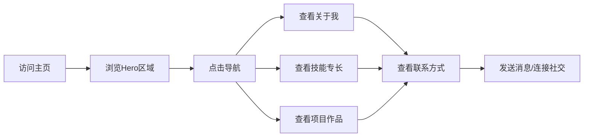

## 1. Product Overview
个人网页展示平台，用于展示个人信息、技能、项目作品和联系方式，帮助访客快速了解个人背景和专业能力。
- 主要目的：个人品牌展示、职业社交、作品展示
- 目标用户：潜在雇主、合作伙伴、行业同行

## 2. Core Features

### 2.2 Feature Module
1. **主页**: Hero区域展示个人头像和简介、导航栏
2. **关于我**: 个人背景介绍、教育经历、工作经历
3. **技能专长**: 技术技能展示、专业能力标签
4. **项目作品**: 项目卡片展示、项目详情链接
5. **联系方式**: 社交媒体链接、邮箱联系方式

### 2.3 Page Details
| Page Name | Module Name | Feature description |
|-----------|-------------|---------------------|
| 主页 | Hero区域 | 大标题展示姓名和职位，副标题展示个人简介，背景渐变动画效果 |
| 主页 | 导航栏 | 固定顶部导航，平滑滚动到各区域，移动端汉堡菜单 |
| 关于我 | 个人介绍 | 详细的个人背景描述，支持段落和列表展示 |
| 关于我 | 时间线 | 教育和工作经历的时间线展示 |
| 技能专长 | 技能标签 | 可点击的技能标签，按类别分组展示 |
| 技能专长 | 技能进度条 | 可视化展示技能掌握程度 |
| 项目作品 | 项目卡片 | 网格布局的项目卡片，hover效果展示项目详情 |
| 项目作品 | 项目筛选 | 按类别筛选项目 |
| 联系方式 | 社交链接 | 社交媒体图标链接（GitHub、LinkedIn等） |
| 联系方式 | 联系表单 | 用户可发送消息的表单 |

## 3. Core Process
用户访问主页 → 浏览Hero区域了解个人概况 → 通过导航栏滚动到各区域 → 查看关于我、技能、项目 → 通过联系方式发送消息或连接社交媒体

## 4. User Interface Design

### 4.1 Design Style
- 主色调：深蓝色系 (#1a1a2e)，搭配青色作为强调色 (#00d9ff)
- 按钮风格：圆角矩形，hover时有缩放和阴影效果
- 字体：使用"Playfair Display"作为标题字体，"Inter"作为正文字体
- 布局：单页滚动式，各区域有明确的视觉分隔
- 图标：使用Lucide图标库，简洁现代风格

### 4.2 Page Design Overview
| Page Name | Module Name | UI Elements |
|-----------|-------------|-------------|
| 主页 | Hero区域 | 全屏背景渐变、大字体姓名标题、个人简介文字、CTA按钮 |
| 主页 | 导航栏 | 半透明背景、导航链接、移动端汉堡菜单图标 |
| 关于我 | 时间线 | 垂直时间线、时间节点标记、内容卡片 |
| 技能专长 | 技能标签 | 圆角标签、颜色区分类别、hover放大效果 |
| 项目作品 | 项目卡片 | 卡片式布局、图片覆盖层、标题和描述 |
| 联系方式 | 社交链接 | 图标按钮组、hover变色效果 |

### 4.3 Responsiveness
- 桌面端：完整的多列布局
- 平板端：双列布局，导航栏简化
- 移动端：单列布局，汉堡菜单展开导航

### 4.4 3D Scene Guidance
- 不适用，本项目为2D个人展示页面