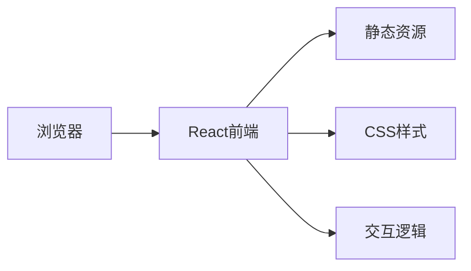

## 1. Architecture Design


## 2. Technology Description
- Frontend: React@18 + tailwindcss@3 + vite
- Initialization Tool: vite-init
- Backend: None（纯静态个人展示页面）
- Database: None

## 3. Route Definitions
| Route | Purpose |
|-------|---------|
| / | 单页应用主页，包含所有展示内容 |

## 4. API Definitions
- 不适用，本项目为纯静态页面，无需后端API

## 5. Server Architecture Diagram
- 不适用，无后端服务

## 6. Data Model
- 不适用，无数据库需求，数据通过组件props直接传递

## 7. Project Structure
```
src/
├── components/
│   ├── Navbar.tsx          # 导航栏组件
│   ├── Hero.tsx            # Hero区域组件
│   ├── About.tsx           # 关于我组件
│   ├── Skills.tsx          # 技能专长组件
│   ├── Projects.tsx        # 项目作品组件
│   └── Contact.tsx         # 联系方式组件
├── App.tsx                 # 主应用组件
├── main.tsx               # 入口文件
└── index.css              # 全局样式
```

## 8. Dependencies
- react@18
- react-dom@18
- tailwindcss@3
- lucide-react (图标库)
- framer-motion (动画库)